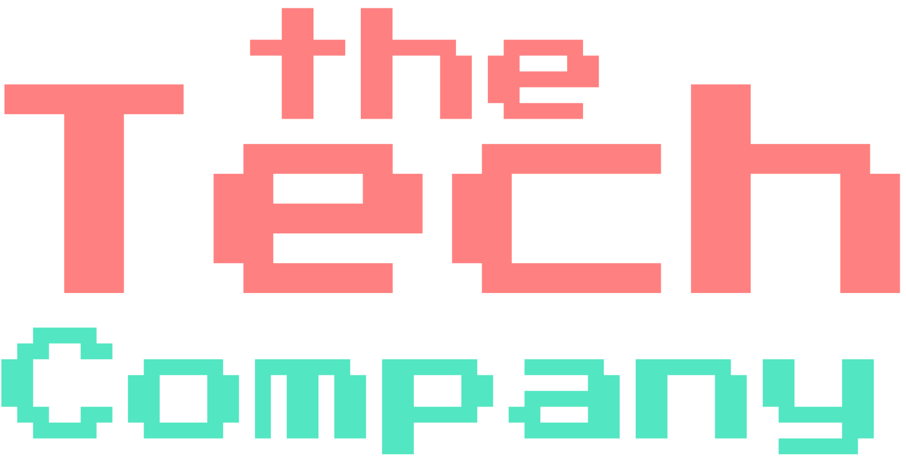

<!-- readme has snippets from https://github.com/othneildrew/Best-README-Template -->
<!-- badges are by the wonderful https://michaelcurrin.github.io/badge-generator/#/ -->

# Team Profile Generator

    
  

    <h3>Team Profile Generator</h3>
     
    <a href="https://github.com/billycwong19/Team-Profile-Generator"><strong>Explore the docs »</strong></a>
     
     
    <a href="https://drive.google.com/file/d/1Bg-cL6omKxs1GFJ5RxEwmCKI0ZBNOvqQ/view?usp=sharing">Video Demo of App</a>
    ·
    <a href="https://github.com/billycwong19/Team-Profile-Generator/issues">Report Bug</a>
    ·
    <a href="https://github.com/billycwong19/Team-Profile-Generator/issues">Request Feature</a>
  

  
Table of Contents

  <ol>
    <li>
      <a href="#about-the-project">About The Project</a>
    </li>
      <ul>
        <li><a href="#license">License</a></li>
        <li><a href="#contributing">Contributing</a></li>
        <li><a href="#contact">Contact</a></li>
      </ul>
    </li>
  </ol>

## About The Project

The Team Profile Generator is an application to create an HTML file based on user input via Node.js. The prompts ask the user to build a team for The Tech Company. Once the user has completed inputting all of the team members information including, name, id, email, and role, the application then generates an HTML file to share and display the current project team. It's pretty to look at and has important information for everyone on the team.

(<a href="#top">back to top</a>)

### License

Distributed under the MIT License. See `LICENSE.txt` for more information.

(<a href="#top">back to top</a>)

### Contributing

Please feel free to contribute!

If you have a suggestion please open an issue then fork the repo and create a pull request.
1. Fork the Project
2. Create your Feature Branch (`git checkout -b feature/newFeature`)
3. Commit your Changes (`git commit -m 'Add some newFeature'`)
4. Push to the Branch (`git push origin feature/newFeature`)
5. Open a Pull Request

(<a href="#top">back to top</a>)

## Contact

Application coded by William Wong.
 
Email: billycwong19@gmail.com

Project Link: [https://github.com/billycwong19/Team-Profile-Generator](https://github.com/billycwong19/Team-Profile-Generator)

(<a href="#top">back to top</a>)
